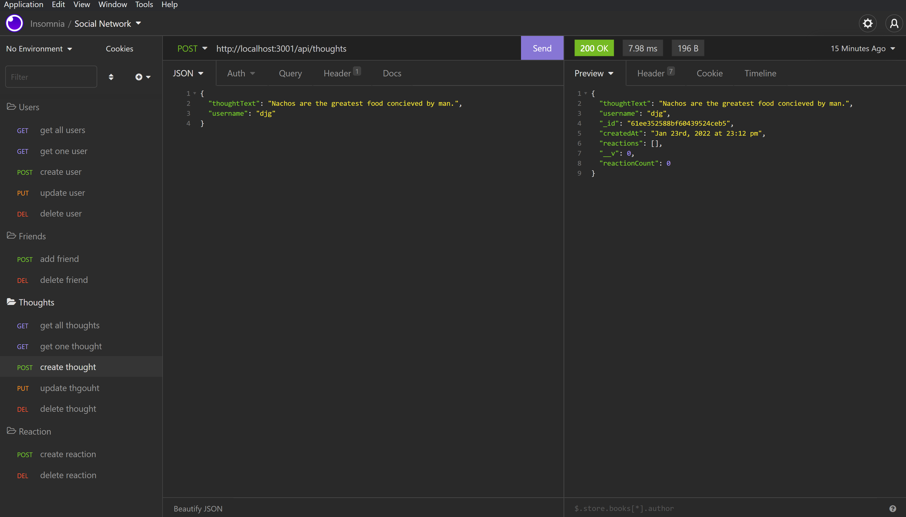

# The Technocracy

## Description
    This social netwrok back end allow users to create, edit, and delete accounts. User can also post their thoughts and react to thoughts. 
  ## Table of Contents
  *[Installation](#installation)

  *[Usage](#usage)

  *[Links](#links)

  ## Installation
    This application requires node.js, express.js, mongoose, and mongoDB. insomnia can be used to run the API routes.

  ## Usage
  Although not yet connected to a front end, insomnia can be used to test routes to api/users and api/thoughts. Watch the video link to see the routes in action.
  

  ## Links

  [GitHub](https://github.com/Dustin2400/social-network)

  [Video](https://watch.screencastify.com/v/l8J55WIdHI6US36QOhkG)

##
  Made with ❤️ by Dustin Grijalva